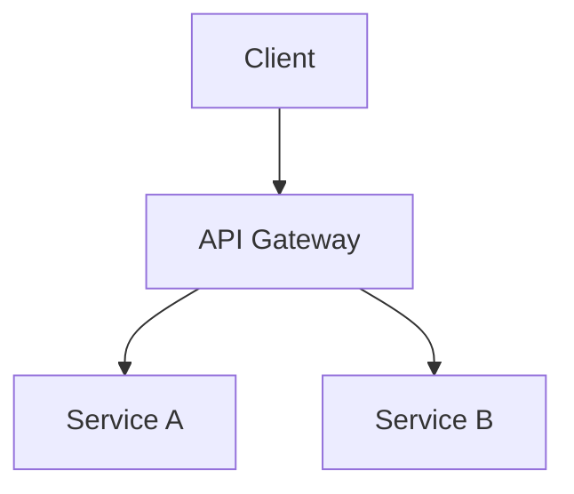

# Mermaid Markdown to PDF Converter

A Python script that automatically renders [Mermaid](https://mermaid.js.org/) diagrams inside Markdown files and exports the result as a PDF — no manual steps, no copy-pasting.

---

## Overview

If you write technical documentation in Markdown and use Mermaid for diagrams, you have likely hit the same wall: standard PDF exporters cannot render Mermaid code blocks. This script solves that problem by automating the full pipeline:

1. Finds every Mermaid code block in your `.md` files.
2. Renders each one as a `.png` image using the Mermaid CLI.
3. Produces a clean intermediate Markdown file with the images embedded.
4. Converts that file to a PDF using Pandoc and XeLaTeX.

You drop your `.md` file in the folder, run one command, and get a `.pdf` out.

---

## How It Works

```
your_file.md
    │
    ├─ [Mermaid CLI]  ──▶  your_file_assets/your_file_diagram_1.png
    │                       your_file_assets/your_file_diagram_2.png ...
    │
    ├─ [Script]       ──▶  your_file_rendered.md  (images replace code blocks)
    │
    └─ [Pandoc + XeLaTeX] ──▶  your_file.pdf
```

The original `.md` file is **never modified**.

---

## Prerequisites

You need the following tools installed before running the script.

### Python

Python 3.6 or higher. No third-party packages are required — only the standard library is used.

- Download: https://www.python.org/downloads/

---

### Node.js + Mermaid CLI (`mmdc`)

Node.js is required to install the Mermaid CLI.

**Windows**
```powershell
winget install OpenJS.NodeJS
npm install -g @mermaid-js/mermaid-cli
```

**macOS**
```bash
brew install node
npm install -g @mermaid-js/mermaid-cli
```

**Linux (Debian/Ubuntu)**
```bash
sudo apt install nodejs npm
npm install -g @mermaid-js/mermaid-cli
```

Verify the installation:
```bash
mmdc --version
```

---

### Pandoc

Pandoc converts the rendered Markdown file to PDF.

**Windows**
```powershell
winget install JohnMacFarlane.Pandoc
```

**macOS**
```bash
brew install pandoc
```

**Linux (Debian/Ubuntu)**
```bash
sudo apt install pandoc
```

Verify:
```bash
pandoc --version
```

---

### XeLaTeX (PDF engine)

XeLaTeX is the PDF engine used by Pandoc. It is part of any standard LaTeX distribution.

**Windows** — Install MiKTeX:
```powershell
winget install MiKTeX.MiKTeX
```

**macOS**
```bash
brew install --cask mactex
```

**Linux (Debian/Ubuntu)**
```bash
sudo apt install texlive-xetex
```

Verify:
```bash
xelatex --version
```

---

## Installation

No installation is required beyond the prerequisites above. Simply download or clone this repository:

```bash
git clone <repository-url>
cd ScriptMD
```

Or just download `render_mermaid_md.py` directly into any folder.

### Automated dependency install (Windows only)

A PowerShell script is included to install all dependencies at once:

```powershell
powershell -ExecutionPolicy Bypass -File install.ps1
```

---

## Usage

1. Place your `.md` file(s) in the **same folder** as `render_mermaid_md.py`.
2. Open a terminal in that folder.
3. Run:

```bash
python render_mermaid_md.py
```

The script will process every `.md` file it finds (excluding any `_rendered.md` files it previously generated).

### Example

Given this input file `report.md`:

````markdown
# System Architecture



Some explanation text here.
````

After running the script you will find:

```
report.pdf                        ← final PDF
report_rendered.md                ← intermediate Markdown with images
report_assets/
    report_diagram_1.mmd          ← raw Mermaid source
    report_diagram_1.png          ← rendered diagram image
```

---

## Output Structure

For each input file `<name>.md`, the script produces:

| Output | Description |
|---|---|
| `<name>.pdf` | Final PDF with all diagrams rendered |
| `<name>_rendered.md` | Intermediate Markdown with image references |
| `<name>_assets/` | Folder containing `.mmd` sources and `.png` images |

The original `.md` file is never modified.

---

## Troubleshooting

**`'mmdc' not found in PATH`**
The Mermaid CLI is not installed or not on your PATH. Run:
```bash
npm install -g @mermaid-js/mermaid-cli
```
Then open a new terminal and try again.

---

**`[ERROR] Mermaid failed on block N`**
The Mermaid syntax in that block is invalid. Check the diagram code in your `.md` file. The script will skip the broken block and continue processing the rest of the file.

---

**`[ERROR] Pandoc failed`**
Usually caused by a missing XeLaTeX installation. Confirm it is installed:
```bash
xelatex --version
```
If the command is not found, install a LaTeX distribution as described in the [Prerequisites](#prerequisites) section.

---

**No `.md` files found**
Make sure your Markdown files are in the **same directory** where you run the script, not in a subdirectory.

---

## Limitations

- The script only looks for `.md` files in the **current working directory**. Subdirectories are not scanned.
- All Mermaid diagrams are rendered as `.png`. Vector formats (`.svg`) are not currently supported.
- The PDF engine is fixed to XeLaTeX. Other Pandoc engines (e.g., `pdflatex`, `wkhtmltopdf`) are not used.

---

## Contributing

Contributions are welcome. If you want to propose a change, fix a bug, or add a feature:

1. Fork the original repository.
2. Create a branch for your change (`git checkout -b feature/your-feature`).
3. Commit your changes and open a pull request against the original repository.

Please do not publish your own modified fork as a standalone project.

## License

This project is free to use for any purpose, including commercial use.

**Modifications are not permitted to be distributed independently.** All changes must be submitted to the original repository via a pull request.

See the [LICENSE](LICENSE) file for the full terms.
